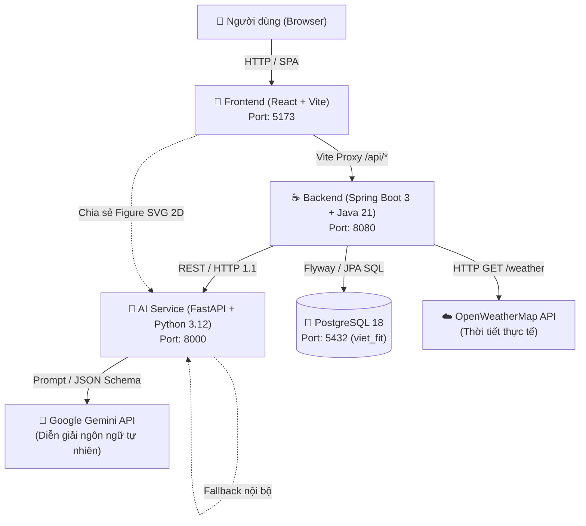

# VIỆT FIT — Dự án Trải Nghiệm và Remix Việt Phục cùng AI

Hệ thống ứng dụng văn hóa - công nghệ kết hợp **Việt phục truyền thống**, **Công nghệ AI Stylist (Google Gemini + Rule Engine)**, **Backend Spring Boot 3 (Java 21)** và **Frontend React (Vite & Tailwind)**.

---

## 🏛 Kiến trúc tổng thể và Liên kết thư mục



---

## 📁 Cấu trúc Monorepo

| Thư mục | Ngôn ngữ / Công nghệ | Vai trò trong hệ thống |
| :--- | :--- | :--- |
| **[`frontend/`](./frontend)** | React 18, TypeScript, Vite, Tailwind | Giao diện người dùng: Landing, Stylist Form, Concept Cards, Studio phối đồ 2D canvas nhiều lớp (SVG), trang Look detail. |
| **[`backend/`](./backend)** | Java 21, Spring Boot 3, JPA, Flyway | Trung tâm xử lý nghiệp vụ: Quản lý catalog Việt phục, lưu trữ Look, gọi OpenWeather, kết nối AI Service và kiểm tra văn hóa. |
| **[`ai-service/`](./ai-service)** | Python 3.12, FastAPI, Pydantic | Động cơ trí tuệ nhân tạo: Bộ luật phối đồ lịch sử (Rule engine), chấm hài hòa màu sắc OKLCH, tích hợp Google Gemini AI và nhánh dự phòng. |
| **[`frontend/src/assets/figure/`](./frontend/src/assets/figure)** | SVG Vector Layers | Kho tài nguyên đồ họa 2D chia sẻ: Thân người, trang phục (áo dài, tứ thân, ngũ thân, nhật bình, bà ba), phụ kiện 4 góc nhìn. |
| **[`.vscode/`](./.vscode)** | VS Code Configurations | Cấu hình IDE tích hợp sẵn: Debug Spring Boot + FastAPI (F5), chạy tasks, cấu hình Java LS & Python venv. |

---

## 🚀 Khởi động nhanh (Quick Start)

### Cách 1: Sử dụng PowerShell Script (Khuyến nghị cho Windows)
Chỉ cần chạy lệnh từ thư mục gốc của dự án:
```powershell
.\start-all.ps1
```
Để dừng toàn bộ các tiến trình:
```powershell
.\stop-all.ps1
```

### Cách 2: Sử dụng lệnh npm monorepo
```bash
npm run dev:frontend   # Khởi động riêng Frontend
npm run dev:backend    # Khởi động riêng Backend
npm run dev:ai         # Khởi động riêng AI Service
npm test               # Chạy toàn bộ test suites của 3 dịch vụ
npm run build          # Đóng gói build cho cả frontend và backend
```

### Cách 3: Chạy toàn bộ với Docker Compose
```bash
docker compose up --build -d
```

---

## 🔗 Luồng dữ liệu tích hợp (Data Flow)

1. **Khám phá & Chọn bối cảnh (`/stylist`)**:
   - Frontend gửi yêu cầu lấy thời tiết Hà Nội/TP.HCM -> Backend gọi OpenWeatherMap -> Trả về nhiệt độ và điều kiện thời tiết thực tế.
   - Người dùng chọn dịp (Tết, Lễ hội,...), phong cách (Gen Z, Truyền thống,...), màu sắc và nhập mong muốn.
2. **Đề xuất Concept (`/concepts`)**:
   - Frontend gọi `POST /api/recommendations` -> Backend gửi reference data kèm context thời tiết sang AI Service -> AI Service chấm luật và đề xuất đúng 3 concept phù hợp văn hóa -> Trả về kết quả hiển thị.
3. **Phối đồ trong Studio (`/mix/:conceptId`)**:
   - Frontend render nhiều lớp SVG từ thư mục `figure/`.
   - Người dùng thay đổi màu sắc, thêm bớt phụ kiện, gọi **AI Remix** hoặc **Kiểm tra văn hóa** theo thời gian thực.
4. **Lưu trữ & Chia sẻ (`/look/:lookId`)**:
   - Khi hoàn thành, frontend gửi `POST /api/looks` -> Backend lưu vào PostgreSQL và cấp phát ID vĩnh viễn để chia sẻ.

---

## ⚙️ Cấu hình biến môi trường (`.env`)

Tất cả cấu hình tập trung tại file [`.env`](./.env) ở thư mục gốc:
```env
DATABASE_URL=jdbc:postgresql://localhost:5432/viet_fit
DATABASE_USERNAME=viet_fit
DATABASE_PASSWORD=change-me
WEATHER_API_KEY=
GEMINI_API_KEY=
GEMINI_MODEL=gemini-3.5-flash
AI_SERVICE_URL=http://localhost:8000
```
*(Nếu chưa có `GEMINI_API_KEY`, hệ thống sẽ tự động chuyển sang chạy Rule Engine dự phòng mà không phát sinh lỗi).*
"# AI---ARENA" 
